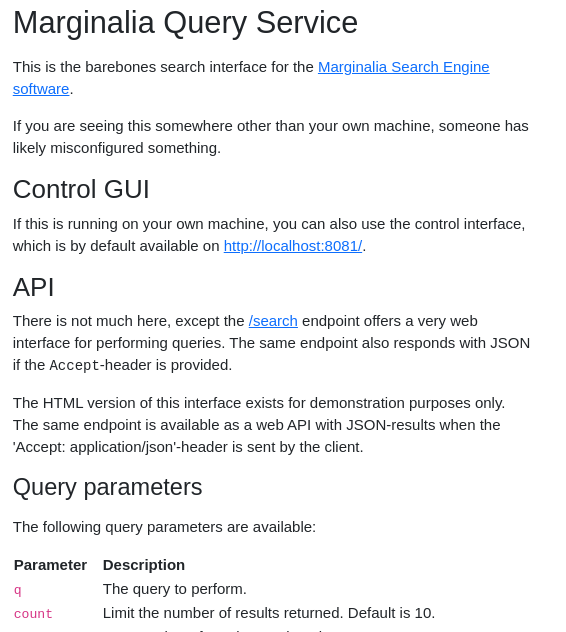
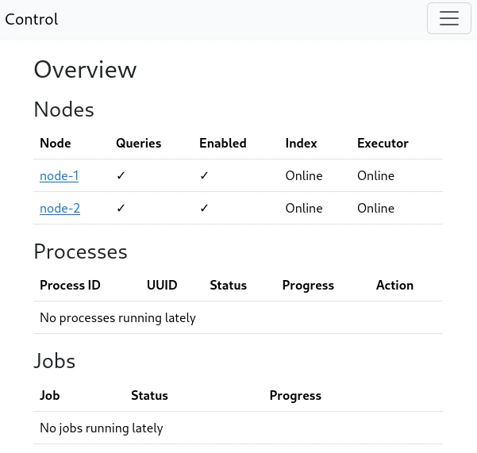

To install the search engine software, you need to clone the repository.

```bash
$ git clone https://github.com/MarginaliaSearch/MarginaliaSearch.git
```

This will create a directory called `MarginaliaSearch` in your current directory.  Change into that directory, and run the `setup.sh` script.  

It will download a bunch of additional files, primarily from https://downloads.marginalia.nu.   This is necessary as the search engine uses large binary model files for language processing, and these don't agree well with git.

```bash
$ run/setup.sh
```

Next, you need to build the sources and create docker images. 

```bash
$ ./gradlew docker
```

Finally, you can install the search engine.  To do this, a script is provided that will create a directory structure and copy the necessary files into it.  The script will also create a `docker-compose.yml` file that can be used to start the search engine.

```bash
$ ./run/install.sh /path/to/install
```

You will be prompted for a few things.  First, you will be asked whether to create a barebones 1-node deployment, a barebones 2-node deployment, or a marginalia search like install. The barebones variants are for running a general purpose search engine, the latter is for running a mirror of the Marginalia Search Engine (e.g. for development tasks). *If you plan on mixing sideloaded and crawled content, a 2-node deployment is recommended.*  You can add additional nodes later, but this is a bit involved.

Next you will be asked to create a mariadb user and password.  This is used for the database that stores the supplemental data for the search engine.

Finally, the script will copy the necessary files into the install directory, and create a `docker-compose.yml` file.  You can then start the search engine with `docker-compose up -d`.

```bash
$ docker-compose up -d
```

The search engine will take a moment to start up, and you can check the logs with `docker-compose logs -f` to see when it is ready.

Once started, you can access a basic search interface at [http://localhost:8080/](http://localhost:8080/).  This is a barebones search interface, and is not intended for general use.  It is primarily for testing purposes.  The search engine is designed to be used over REST, and the search interface is just a thin wrapper around that.  

<figure>
    
    <figcaption>This view should greet you upon visiting port 8080</figcaption>
</figure>

You also have access to a control interface at [http://localhost:8081/](http://localhost:8081/).  This is where the search engine is configured and operated. 

<figure>
    
    <figcaption>This control view should greet you upon visiting port 8081</figcaption>
</figure>
