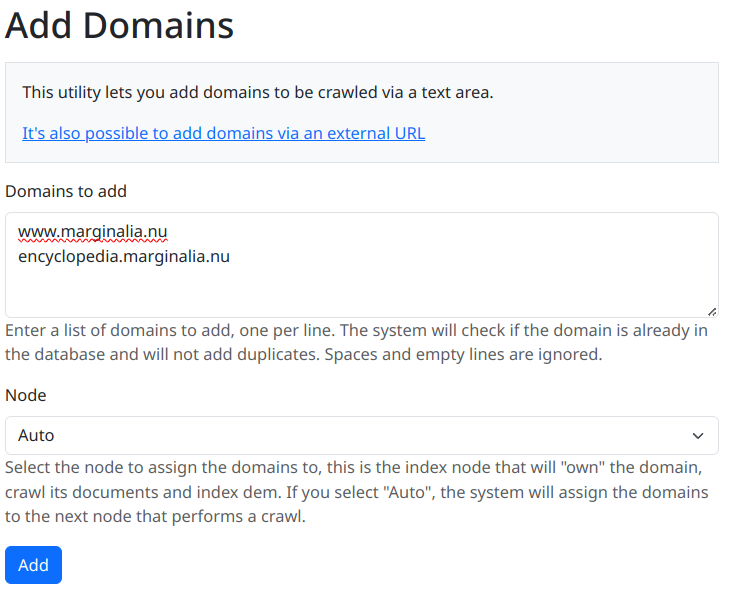
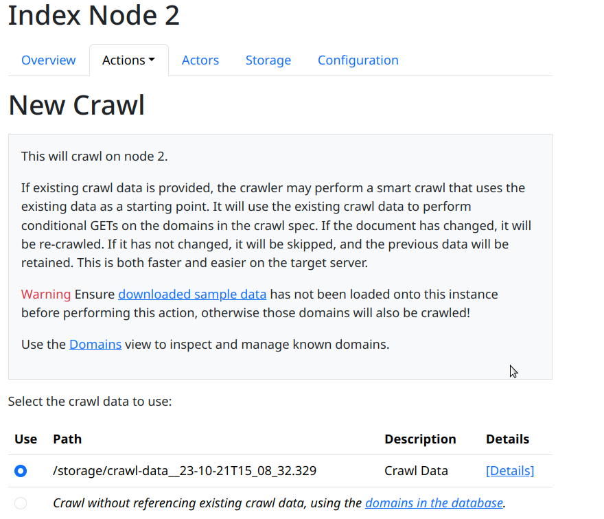
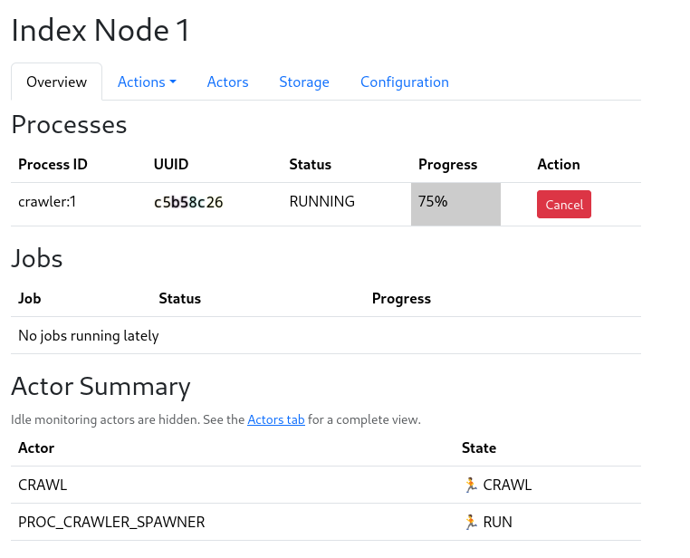

NOTE: Please be sure to read the [crawling disclaimer](/2_crawling/#important-disclaimer-about-web-crawling) before proceeding.

## Bootstrapping the domain database

While a running search engine can use the link database to figure out which websites to visit, a clean
system does not know of any links, so you must add a few domains yourself.  To do this, either follow the
link in the New Crawl GUI, or use the top menu and select `Domains->Add Domains`

<figure>
    
    <figcaption>
       Adding new known domains to the system.
    </figcaption>
</figure>

Fill out the form by adding a list of domains to seed the search engine with.  You also have the option to select a node affinity for the domains, which index node will be assigned to the domains, but if you leave it at the default value, the next index node to crawl will be assigned, which is typically what you want.

## Starting a crawl

To start a new crawl, go to `Nodes->Node N->Actions->New Crawl`, and you should see a page like this:

<figure>
    
    <figcaption>
        The New Crawl view.
    </figcaption>
</figure>

If you have already performed a crawl on the index node, you have the option to re-use that crawl data to reduce the number of
network requests sent, and build upon it to fetch more documents.  If it's a clean system, you have only the option to start fresh.

Select the option you prefer, and and click `[Trigger New Crawl]`.

This will start the crawling process.  Crawling may take a while, depending on the size
of the domain list and the size of the websites.  

<figure>

<figcaption>A screenshot of a crawl in progress.</figcaption>
</figure>

Eventually a process bar will show up, and the crawl will start.  When it reaches 100%, the crawl is done.
You can also monitor the `Events Summary` table on the same page to see what happened after the fact.

It is expected that the crawl will stall out toward the end  of the process, this is a statistical effect since
the largest websites take the longest to finish, and tend to be the ones lingering at 99% or so completion.  The
crawler has a timeout of 5 hours, where if no new domains are finished crawling, it will stop, to prevent crawler traps
from stalling the crawl indefinitely. 
