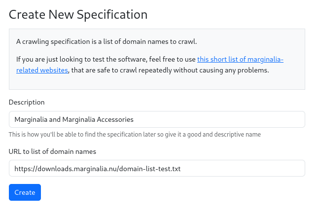
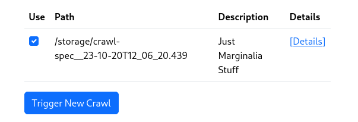

NOTE: Please be sure to read the [crawling disclaimer](/2_crawling/#important-disclaimer-about-web-crawling) before proceeding.

While a running search engine can use the link database to figure out which websites to visit, a clean
system does not know of any links.  To bootstrap a crawl, a crawl specification needs to be created to 
seed the domain database.

Go to `Nodes->Node N->Actions->New Crawl`, and you should see a page like this:

<figure>
    
    <figcaption>
        With no crawls in the system, the only option is to create a new crawl.
    </figcaption>
</figure>

Click the link that says 'New Spec' to arrive at a form for creating a new specification:

<figure>
    
    <figcaption>
        Form for creating a new crawl specification.
    </figcaption>
</figure>

Fill out the form with a description and a link to a domain list.  The domain list is a text file with one domain per line, with blank lines and comments starting with `#` ignored.  

You can use github raw links for this purpose.  For test purposes, you can use this link: `https://downloads.marginalia.nu/domain-list-test.txt`, which will create a crawl for a few
of marignalia.nu's subdomains.

If you aren't redirected there automatically, go back to the `New Crawl` page under Node N -> Actions.  Your new specification should now be listed.  

Check the box next to it, and click `[Trigger New Crawl]`.

<figure>
    
    <figcaption>After having created a new crawl specification, the 'new crawl' view should look something like this.</figcaption>
</figure>

This will start the crawling process.  Crawling may take a while, depending on the size
of the domain list and the size of the websites.  

<figure>

<figcaption>A screenshot of a crawl in progress.</figcaption>
</figure>

Eventually a process bar will show up, and the crawl will start.  When it reaches 100%, the crawl is done.
You can also monitor the `Events Summary` table on the same page to see what happened after the fact.

It is expected that the crawl will stall out toward the end  of the process, this is a statistical effect since
the largest websites take the longest to finish, and tend to be the ones lingering at 99% or so completion.  The
crawler has a timeout of 5 hours, where if no new domains are finished crawling, it will stop, to prevent crawler traps
from stalling the crawl indefinitely. 
