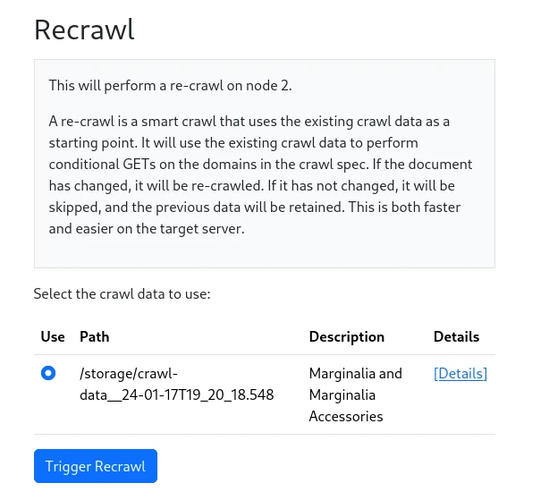

The work flow with a crawl spec was a one-off process to bootstrap the search engine.  To keep the search engine up to date,
it is preferable to do a recrawl.  This will try to reduce the amount of data that needs to be fetched.

To trigger a Recrawl, go to `Nodes->Node 1->Actions->Re-crawl`.  This will bring you to a page that looks similar to the 'new crawl page', where you can select a set of existing crawl data to use as a source.  

Select the crawl data you want, and press `[Trigger Recrawl]`. 

<figure>
    
    <figcaption>Recrawl Dialog</figcaption>
</figure>

Crawling will proceed as before, but this time, the crawler will try to fetch only the data that has changed since the last crawl, increasing the number of documents by a percentage.  This will typically be much faster than the initial crawl.  

The recrawl will update the set of crawl data it was based on, so that the next recrawl will be based on the latest data.  This means that the first recrawl will be a full crawl, but subsequent recrawls will be incremental.