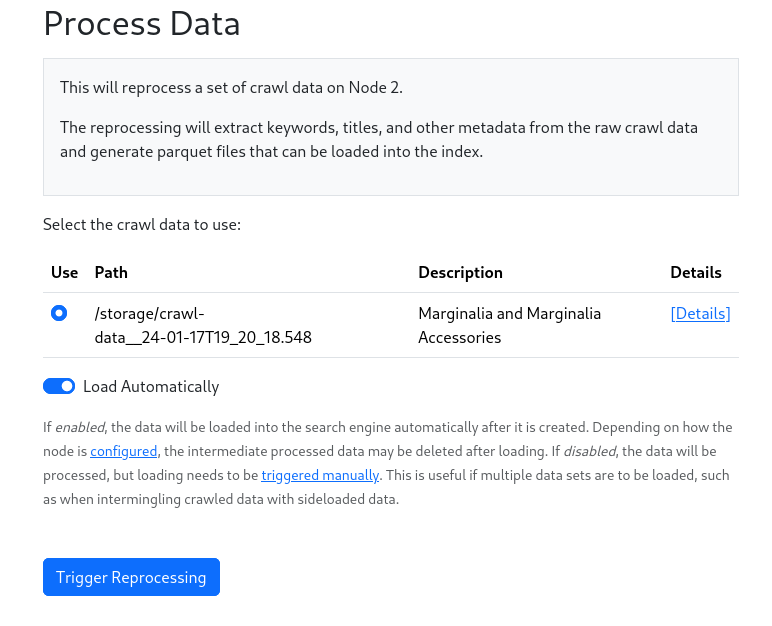
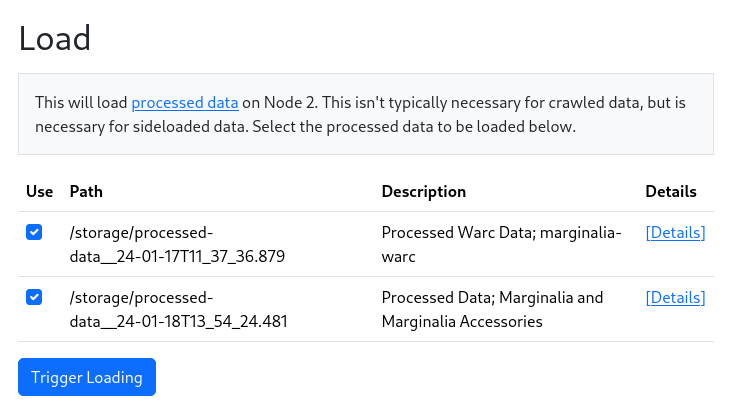
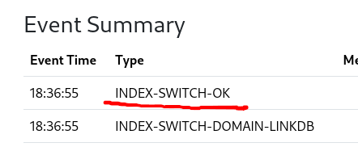

Once the crawl is done, the data needs to be processed before its searchable.  This process extracts keywords and features from the documents, and converts them into a format that can be loaded into the search engine.

This is done by going to `Nodes->Node 1->Actions->Process Crawl Data`.

<figure>

<figcaption>Process Crawl Data Dialog</figcaption>
</figure>

This will start the conversion process.  This will again take a while, depending on the size of the crawl. 
The process bar will show the progress.  Depending on whether you select `Load Automatically`, the data will be loaded into the search engine.  If you don't select this, you can load the data later by going to `Nodes->Node 1->Actions->Load Processed Data`.

Manual loading is useful both for debugging, and if you wish to load multiple sources of data into the same index, such as
when sideloading data from other sources like WARC files or a Wikipeida dump.  

When loading automatically, only the selected data will be loaded.

<figure>

<figcaption>Load Data Dialog</figcaption>
</figure>

Whether loading manually, or automatically, a cascade of actions is performed in sequence, leading to the data being loaded into the search engine and an index being constructed.  This is all automatic, but depending on the size of the crawl data,
may take a while.

When an event `INDEX-SWITCH-OK` is logged in the `Event Summary` table, the data is ready to be searched.

<figure>

<figcaption>Screenshot of 'INDEX-SWITCH-OK'</figcaption>
</figure>