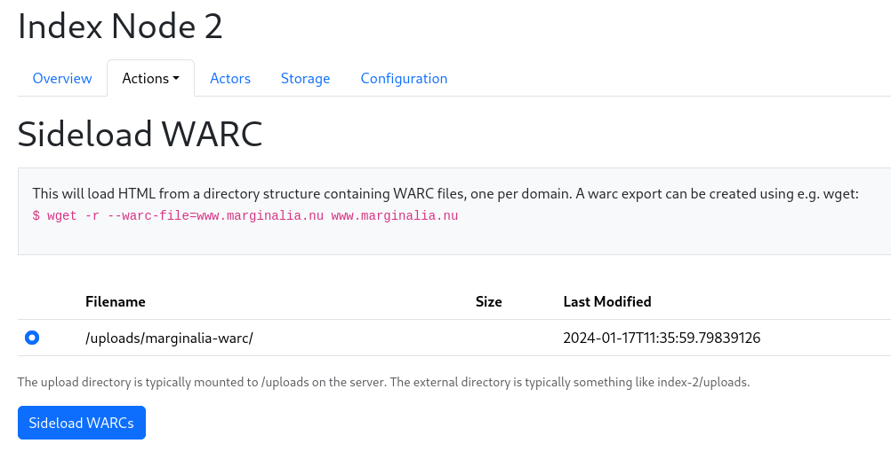
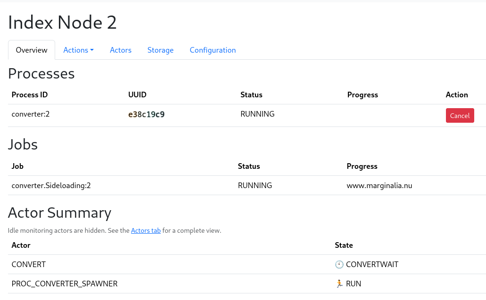
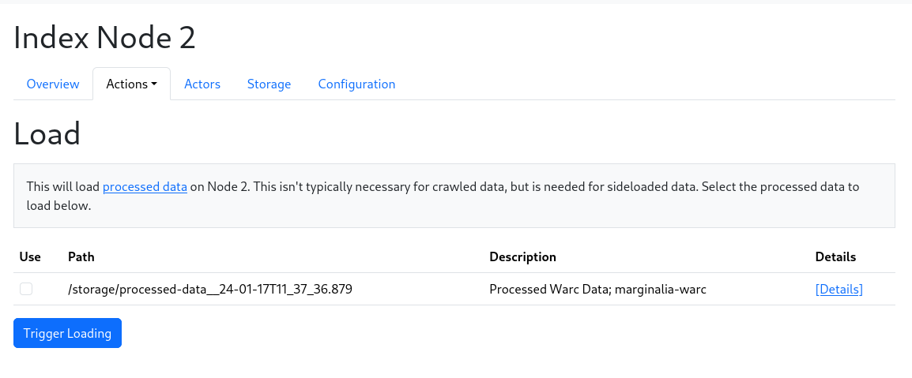

WARC files are the standard format for web archives.  They can be created e.g. with wget.
The Marginalia software can read WARC files directly, and sideload them into the index,
as long as each warc file contains only one domain.

Let's for example archive www.marginalia.nu (I own this domain, so feel free to try this at home)

```bash
$  wget -r --warc-file=marginalia www.marginalia.nu
```

**Note** If you intend to do this on other websites, you should probably add a `--wait` parameter to wget,
e.g. `wget --wait=1 -r --warc-file=...` to avoid hammering the website with requests and getting blocked.

This will take a moment, and create a file called `marginalia.warc.gz`. We move it to the
upload directory of the index node, and sideload it through the Actions menu.

```bash
$ mkdir -p index-2/uploads/marginalia-warc
$ mv marginalia.warc.gz index-2/uploads/marginalia-warc
```

Go to the Actions menu, and select the "Sideload WARC" action.  This will show a list of
subdirectories in the Uploads directory.  Select the directory containing the WARC file, and
click "Sideload".



This should take you to the node overview, where you can see the progress of the sideloading.
It will take a moment, as the WARC file is being processed.  



It will not be loaded automatically.  This is to permit you to sideload multiple sources.

When you are ready to load it, go to the Actions menu, and select "Load Crawl Data".



Select all the sources you want to load, and click "Load".  This will load the data into the
index, and make it available for searching.  
