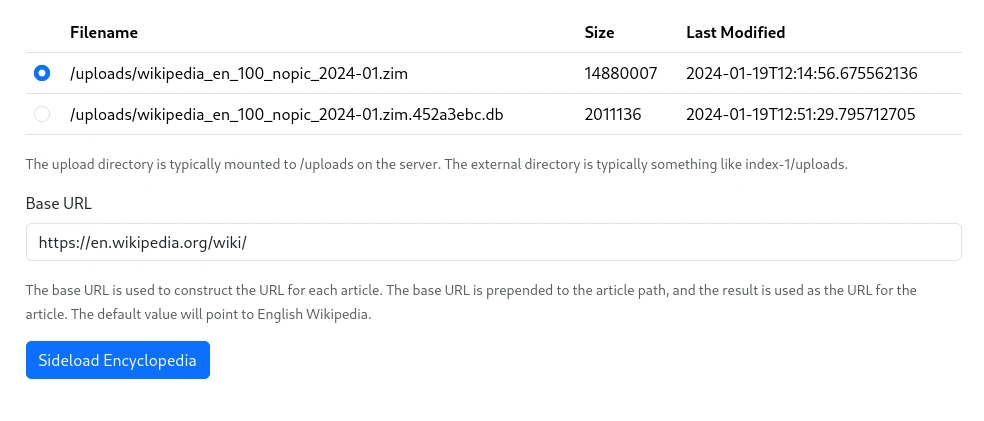
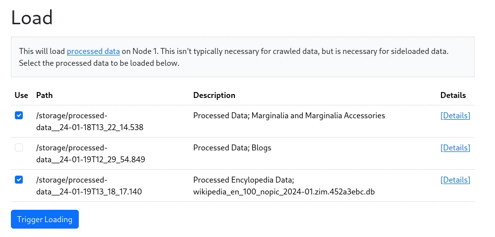

Wikipedia is the archetype of a website that is too large to crawl.  Thankfully, they provide dumps of their data in a format called ZIM.  This is a format that is optimized for offline use, and is used by the Kiwix project to provide offline access to Wikipedia.  Wikipedia's zim files are available for download at https://download.kiwix.org/zim/wikipedia/

Since the search engine doesn't process images, we can use the smaller "no images" version of the dump, `wikipedia_en_all_nopic_YYYY-MM.zim`.  This is still a very large file, and will take up to a day to to process even on a relatively powerful machine.  For testing, you can use e.g. the `wikipedia_en_100_nopic_YYYY-MM.zim` version, which is just 100 articles.

To process the data, place a ZIM file in the Uploads directory.  
Go to `Node 1 -> Actions -> Sideload Encyclopedia`, and select your zim file from the list of available files.

<figure>
    
    <figcaption>The Sideload Encyclopedia form</figcaption>
</figure>

You will need to specify a base URL, which will be used to construct URLs.  By default, this is
`https://en.wikipedia.org/wiki/`, which will create links to the English Wikipedia.  If you want to
link to another mirror, you can change this to something else, e.g. `https://encyclopedia.marginalia.nu/article/`

Once you're ready, click `[Sideload Encyclopedia]`, and the file will be processed.  

The first stage will create a SQLite database with a cleaned up version of the data.  This will be given a 
name similar to the original file, but with a `.(crc32).db`-ending.  It is also possible to load this file 
directly from the same form, if you want to reprocess it for some reason.  The sqlite file should be 
significantly smaller than the original ZIM file.

After predigesting the zim file, the data is converted into Processed Data, which can be loaded from `Actions->Load Processed Data` as usual.

<figure>
    
    <figcaption>Loading form</figcaption>
</figure>