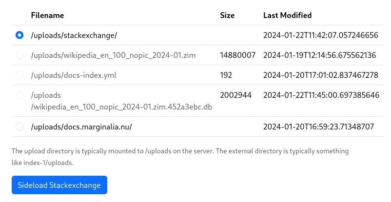

The search engine is capable of side-loading stackexchange data dumps.  These are available
from https://archive.org/details/stackexchange.  The data dumps are available in a compressed XML format.

It is probably a good idea to select the torrent option, as the files are quite large, and archive.org's
servers are not particularly fast.  This will also allow you to limit the download to the sites you are
interested in.

The system will digest the 7z files *directly*, so you don't need to uncompress them.  (The uncompressed
files are enormous, so you probably don't want to do that.)  The search engine will only index the Post
data, not the comments or meta data.

In order to load the data, put the 7z files corresponding to the sites you are interested in into a directory 
in the upload directory.  Then go to `Index Nodes -> Node N -> Actions -> Sideload Stackexchange`, and select
the directory containing the 7z files.  Then click 'Sideload Stackexchange`. 

<figure>

<figcaption>The Stackexchange Sideload form</figcaption>
</figure>

This will process the data, so that it can be loaded by going to `Index Nodes -> Node N -> Actions -> Load Processed Data`,
and selecting the appropriate data.

When processing the data, it will first be converted to a more compact format, a sqlite database; and then loaded into the index.
The converted data will be saved in the source directory, so that it can be reloaded without having to reprocess the data.  To completely
re-process the data, delete the `*.db` files in the source directory, keeping the `*.7z` files.