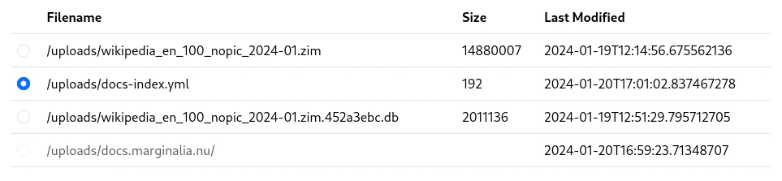

For relatively small websites, ad-hoc side-loading is available directly from a
folder structure on the hard drive. This is intended for loading manuals, 
documentation and similar data sets that are large and slowly changing.

A website can be archived with wget, like this

```bash
wget -nc -x --continue -w 1 -r -A "html" "docs.marginalia.nu"
```

After doing this to a bunch of websites, create a YAML file in the upload directory,
with contents something like this:

```yaml
sources:
- name: jdk-20
  dir: "jdk-20/"
  domainName: "docs.oracle.com"
  baseUrl: "https://docs.oracle.com/en/java/javase/20/docs"
  keywords:
  - "java"
  - "docs"
  - "documentation"
  - "javadoc"
- name: python3
  dir: "python-3.11.5/"
  domainName: "docs.python.org"
  baseUrl: "https://docs.python.org/3/"
  keywords:
  - "python"
  - "docs"
  - "documentation"
- name: mariadb.com
  dir: "mariadb.com/"
  domainName: "mariadb.com"
  baseUrl: "https://mariadb.com/"
  keywords:
  - "sql"
  - "docs"
  - "mariadb"
  - "mysql"
```

The fields in the above are

|parameter|description|
|----|----|
|name|Purely informative|
|dir|Path of website contents relative to the location of the yaml file|
|domainName|The domain name of the website|
|baseUrl|This URL will be prefixed to the contents of `dir`|
|keywords|These supplemental keywords will be injected in each document|

The directory structure corresponding to the above might look like this:

```
docs-index.yaml
jdk-20/
jdk-20/resources/
jdk-20/api/
jdk-20/api/[...]
jdk-20/specs/
jdk-20/specs/[...]
jdk-20/index.html
mariadb.com
mariadb.com/kb/
mariadb.com/kb/[...]
python-3.11.5
python-3.11.5/genindex-B.html
python-3.11.5/library/
python-3.11.5/distutils/
python-3.11.5/[...]
[...]
```

So e.g. the file `jdk-20/api/java.base/java/lang/Thread.html` would refer to the URL
`https://docs.oracle.com/en/java/javase/20/docs/api/java.base/java/lang/Thread.html`.

After creating the directory structure, go to the `Index  Nodes -> Node N -> Actions -> Sideload Dirtree`,
and select the directory containing the structure.  Then click 'Sideload Dirtree`.  This will process the
data, so that it can be loaded.

<figure>

<figcaption>Sideload Dirtree form</figcaption>
</figure>

As usual with sideloaded data, after the data has been processed it can be loaded by going to `Index Nodes -> Node N -> Actions -> Load Processed Data`.