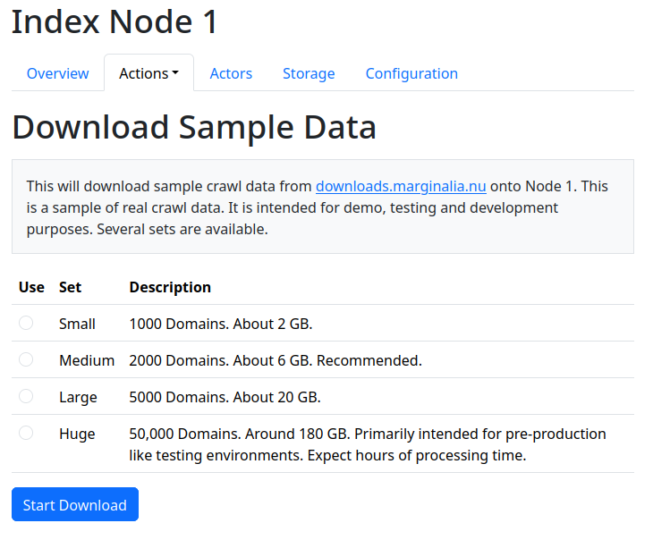
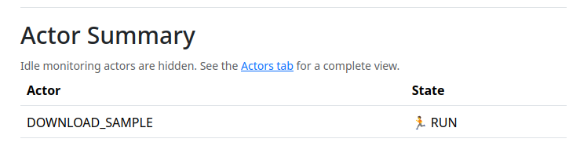

It is possible to download sample crawl data from the marginalia search project.  This is useful for quickly
setting up a test environment for experimentation or assessment of changes to the code.

**Caveat** If you load sample data into the system, these domains will also be included in future re-crawls.
It is a good practice to segregate test environments with sample data from real environments, to avoid contamination
of the domains table.

Sample data is available at `Index Nodes -> Node N -> Actions -> Download Sample Crawl Data`.

<figure>

<figcaption>Download Sample Data View</figcaption>
</figure>

Select the set you want, and press `[Start Download]`.  Depending on the choice and your bandwidth,
it may take a while. An actor will perform the downloading action.  When it terminates, the data should
be available to process!

<figure>

<figcaption>While the download runs, so does the actor</figcaption>
</figure>

