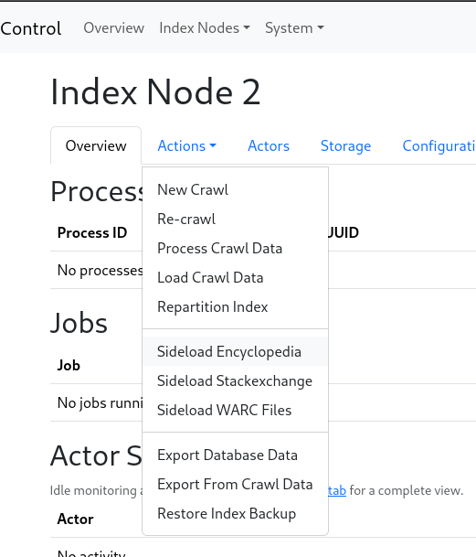

Apart from crawling, data can also be sideloaded into the system.

A difference from the crawl work flow which we've seen before, which created a 
'Crawl Data' storage item, which was turned into 'Processed Data', which was 
then loaded; is that sideloads turn directly into 'Processed Data'.

This section is written assuming that the system is installed with the `install.sh`
script, which deploys the system with docker-compose, and has a directory 
structure like

```
...
index-1/backup/
index-1/index/
index-1/storage/
index-1/uploads/ <--
index-1/work/
index-2/backup/
index-2/index/
index-2/storage/
index-2/uploads/ <--
index-2/work/
...
```

We're going to be putting files in the **uploads** directories.   If you have installed
the system in some other way, or changed the configuration significantly, you need
to adjust the paths accordingly.

Sideloads are accessed through the `Node N-> Actions` menu in the control interface.

<figure>

<figcaption>The actions menu</figcaption>
</figure>
