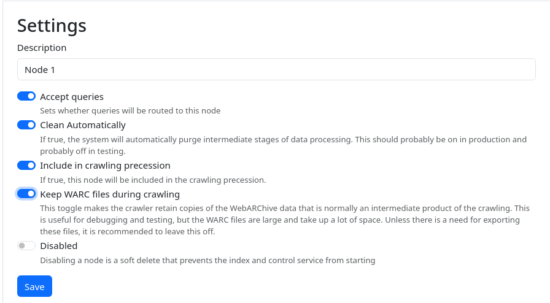

It is possible to configure the crawler to export its crawl data in a WARC format on top of the 
native parquet format.  This is toggled in the node configuration, available from `Index Nodes -> Node N -> Configuration`

<figure>

<figcaption>The node configuration panel, showing the `Keep WARC files during crawling` option</figcaption>
</figure>

If the option `Keep WARC files during crawling` is enabled, the crawler will retain a WARC record of the crawl.

## Output Files

This is stored in the same location as the rest of the crawl data, in a directory `warc`.  That is,
something like `(install-dir)/index-n/storage/crawl_data[...]/warc`

Each crawl will have one `idx` file, and one or more `warc.gz`-files.  The idx file is a 
plain text file containing offsets into the warc.gz-file, for ranges of data corresponding 
to particular domains.

```shell
$ ls warc/
marginalia-crawl-2024-02-09T16-12-01.674824867.idx
marginalia-crawl-2024-02-09T16-12-01.674824867--0000.warc.gz
```

The index file is line based, where each line contains the space-separated fields:

* WARC File Name
* Domain Name
* Start Offset
* Data Length

For example: 
```
$ cat warc/marginalia-crawl-2024-02-09T16-12-01.674824867.idx
marginalia-crawl-2024-02-09T16-12-01.674824867--0000.warc.gz memex.marginalia.nu 0 259
marginalia-crawl-2024-02-09T16-12-01.674824867--0000.warc.gz search.marginalia.nu 259 19425
marginalia-crawl-2024-02-09T16-12-01.674824867--0000.warc.gz encyclopedia.marginalia.nu 19684 10018
marginalia-crawl-2024-02-09T16-12-01.674824867--0000.warc.gz docs.marginalia.nu 29702 116852
marginalia-crawl-2024-02-09T16-12-01.674824867--0000.warc.gz www.marginalia.nu 146554 644091
```

In this example, the crawled data for `docs.marginalia.nu` will be in file 
`marginalia-crawl-2024-02-09T16-12-01.674824867--0000.warc.gz` in the byte range [29702, 29702 + 116852).

This is designed to play well with HTTP range queries, a trick that is also used by the Common Crawl project.  
For local access, `dd` may be used to extract individual domain ranges.

```shell
$ dd ibs=1 
     if=warc/marginalia-crawl-2024-02-09T16-12-01.674824867--0000.warc.gz 
     skip=29702 
     count=116852 | zcat

WARC/1.0
Content-Length: 114
Content-Type: application/http;msgtype=request
WARC-Block-Digest: sha1:IEBLKGIF3RRDSYAZO4VF6AYQHAF756LH
WARC-Concurrent-To: <urn:uuid:209b4919-d9f6-4f3d-b044-e6dbcadd0f2b>
WARC-Date: 2024-02-09T16:12:02Z
WARC-Record-ID: <urn:uuid:dca93c94-605c-4a76-99fc-8334454ec901>
WARC-Target-URI: https://search.marginalia.nu/robots.txt
WARC-Type: request

GET robots.txt HTTP/1.1
Host: search.marginalia.nu
Accept-Encoding: gzip
User-Agent: Mozilla/5.0 (compatible)

...
```

Per the recommendations in the WARC specification, a new file will be created 
the file reaches a size of about 1 GB.


**Note:**  You may see repeated requests for the root document in the WARC data. 
This behavior is an expected part of the crawler's initial discovery process, 
where the URL schema is probed and sitemaps and RSS feeds are discovered.   