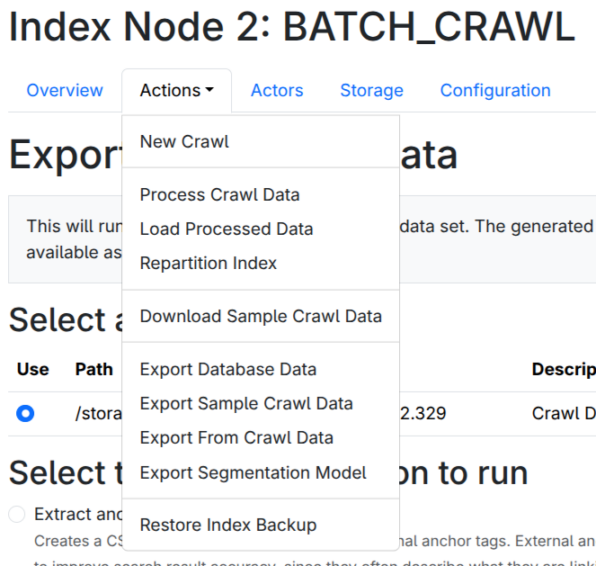
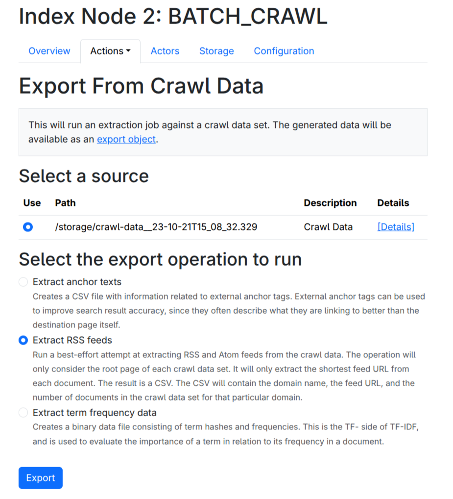
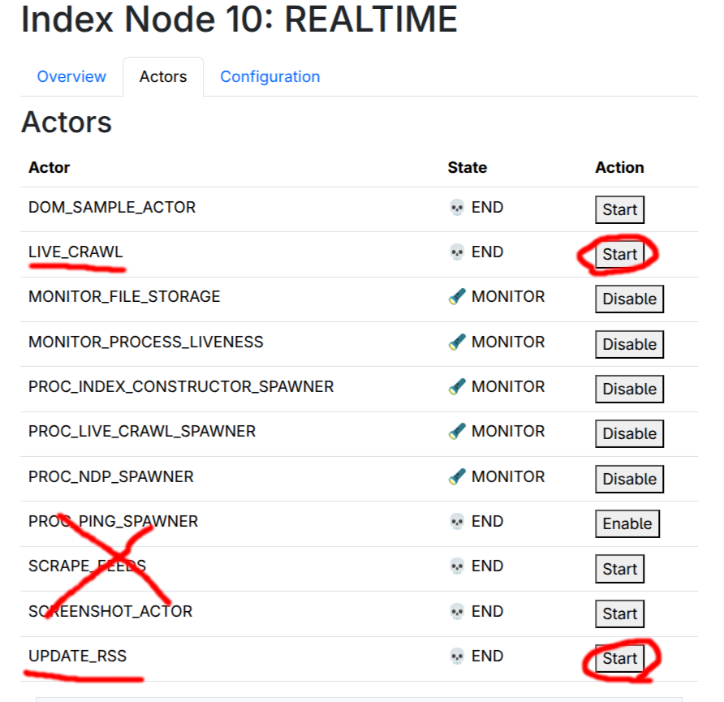

The system also supports real time crawling, in order to get website updates between the slow batch jobs. 
Once set up, this mostly runs autonomously, but needs some configuration in order to operate.

The live crawler uses the RSS feed database to identify new documents, and will index them in a separate (small) index partition.  

For this to work, we need to 

1.  Export known RSS feeds
2.  Set up a daily RSS feed fetching job (that acts upon the data from #1)
3.  Set up a daily Live Crawling job (that acts upon the data from #2)

## Step 1: Configure Node Profiles

The realtime crawling will only run on an index partition configured with the `REALTIME`
profile, and will feed off RSS feeds found via the regular batch crawl operation.  As such you'll want at least one `BATCH CRAWL` and one `REALTIME` partition.

Refer to [Chapter 3.1](/3_configuration_options/1_node_configuration/) for information about how to configure index partition profiles.

## Step 2: Run a batch crawl

We must have some crawl data to continue.  Refer back to Chapters 2.1 and 2.2.

## Step 3: Export RSS feeds

If the `SCHEDULED_MAINTENANCE` actor is running, the system will automatically export RSS feeds on certain days of the month, but in order to avoid having to wait several weeks for this to happen, we can do it manually.

On the batch crawl partition(s), manually export RSS feeds.

<figure>

<figcaption>
Actions-&gt;Export From Crawl Data
</figcaption>
</figure>

<figure>

<figcaption>
Then select 'Extract RSS feeds'
</figcaption>
</figure>

This may take a moment, wait until the job finishes.  

## Step 4: Review the schedule

Update the Realtime Schedule and decide when the Live Crawler and Update Rss tasks should run.
You don't want these to overlap.

Review [Chapter 3.4](/3_configuration_options/4_schedule/).

## Step 5: Enable the actors

Once you are happy with the choice in run schedules, go to `Index Nodes -> (your realtime node)`, then select the `Actors` tab.

Enable the `UPDATE_RSS` and `LIVE_CRAWL` actors, by clicking their `Start` buttons.
**Do not enable other actors, unless you understand what they are doing.**  Most configurations will have multiple disabled actors in this screen.  This is fine.

<figure>

<figcaption>
Enable the `UPDATE_RSS` and `LIVE_CRAWL` actors.
</figcaption>
</figure>

After the schedule has been run, which will be after about a day, the REALTIME partition will have indexed data and will serve traffic.

