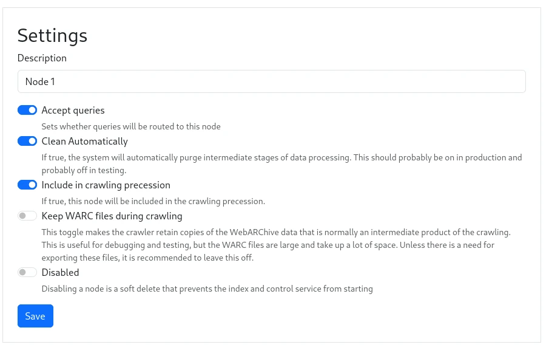

Under `Nodes -> Node N -> Configuration`, you will find a list of configuration options that can be set for each node.

<figure>
    
    <figcaption>Node Configuration Dialog</figcaption>
</figure>

### Accept Queries

This option toggles whether the query service will route queries to this node.  This is useful if you want to take 
a node out of rotation for some reason.

### Keep WARC files during crawling

If this option is enabled, the WARC files be compacted into common-crawl style indexed WARC files. 
The persisted WARC files are kept in a directory `warc/` under the crawl file storage. 
If this option is disabled,  the WARC files will be deleted after the crawl is complete.

### Clean Automatically

With this option enabled, the system will automatically remove processed data after it's loaded,
when loading automatically.  This is a good option to have enabled for a node that deals with
crawled data, as it will save disk space (or manual labor deleting the files).