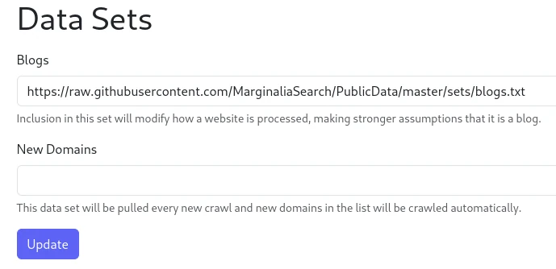

Under `System -> Data Sets`, you will find a couple of options.  Thse define URLs that the system will use to
download data sets from.  

<figure>
    
    <figcaption>Data Sets</figcaption>
</figure>

## Data Set URLs

### Blogs

The blogs list is a list of domains that the system considers to be blogs.  This affects how these domains are processed,
paths like /tags or /category are ignored, and the system will operate on the assumption that the content is a blog post.

The blogs set is also the basis for the `BLOGS` Domain Ranking Set, which will be described an adjacent chapter.

### New Domains

During a recrawl, the system will poll this URL for a list of additional new domains to crawl.  This is useful for growing
the list of domains that the system crawls over time.