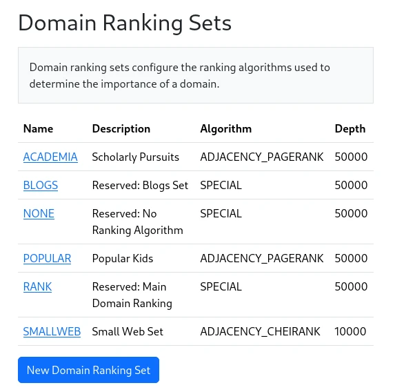
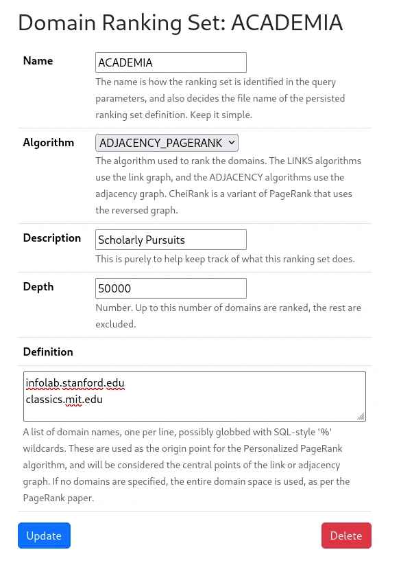

Under `System -> Domain Ranking Sets`, you will find a list of domain ranking sets.  These are configurations for the
domain ranking system.  The domain ranking system is a system for assigning a score to each domain, which affects the
order in which the domains are considered in the index.  Thus a high ranking means results from a domain is more likely 
to be returned in a query.

A few domain ranking sets are reserved, and cannot be deleted.  These are the `BLOGS`, `NONE` and `RANK`.  Additional
sets can be configured. 

<figure>
    
    <figcaption>Ranking Sets</figcaption>
</figure>

The `BLOGS` set is a set of domains that the system considers to be blogs.  These are pulled from a Data Set URL, which
is configured under `System -> Data Sets`.  `NONE` is a reserved set that permits all domains.  `RANK` is a reserved set
that is used to rank domains. 

`RANK` and the ad-hoc sets can be configured by clicking on the link.  This will bring up a form that allows you to
configure the set.  The form looks like this:

<figure>
    
    <figcaption>Configuration Form</figcaption>
</figure>

The **Algorithm** choice lets you choose which ranking algorithm to use:

* Link Pagerank - This is the standard PageRank algorithm, which is based on the link graph.
* Link CheiRank - This is the standard CheiRank algorithm, which is based on the link graph.  CheiRank is the
  complement of PageRank, and is used to rank pages that are not linked to.
* Adjacency Pagerank - This is a Marginalia Search specific algorithm that is similar to the Link PageRank algorithm, but
  it uses a different graph. 
* Adjacency CheiRank - This is a Marginalia Search specific algorithm that is similar to the Link CheiRank algorithm, but
  it uses a different graph. 

In practice you probably want to use the Link PageRank algorithm, as it is the most well-known, and the most well-tested.

The **Depth** parameter controls the size of the result set.  Any domains not in the top N will be excluded from the ranking set.

The **Definition** field is a text area that lets you enter a list of domains.  Each domain should be on a separate line.
If populated, this is fed into the ranking algorithm to turn it into a Personalized PageRank algorithm.  This is useful
for creating a ranking set that is tailored to your specific tastes.  For example, if you are a fan of a particular
blog, you can add that blog to the definition, and the ranking algorithm will take that into account when ranking the
domains.  For a deeper explanation of what this does, see the [original PageRank paper](https://www.cis.upenn.edu/~mkearns/teaching/NetworkedLife/pagerank.pdf).
