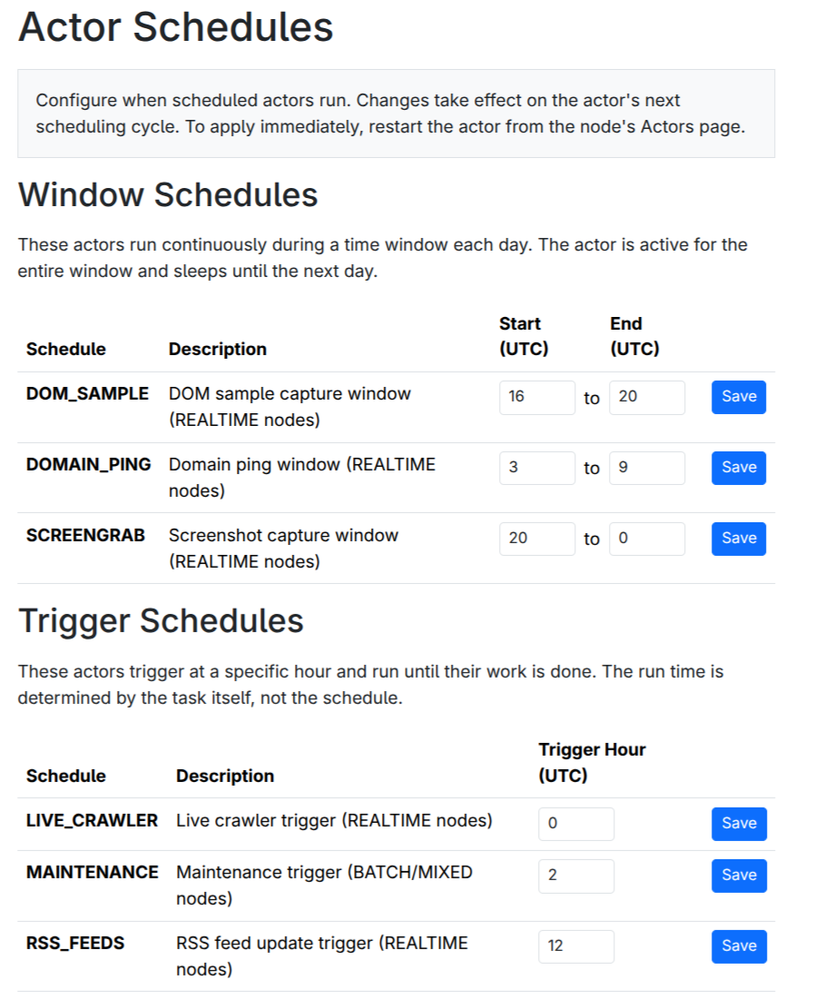

Under `System -> Schedules`, you can configure a schedule for the REALTIME node, if one is configured.

<figure>
    
    <figcaption>Schedule Editor</figcaption>
</figure>

There are several types of jobs that can be scheduled to run at different times of the day.
You generally want to avoid overlapping these run windows as these jobs require significant processing and networking resources.

Each job also corresponds to an actor, unless indicated otherwise these actors run on the REALTIME partition.
To avoid inadvertently performing operations that are not desired, 
these actors need to be manually started before the schedule will have an effect.
See [Chapter 5.2](/5_operations/2_message_queue_and_actors/) for more information on how to do that.

**Window Schedules** are jobs that run for a specified number of hours.

* Dom Sample (`DOM_SAMPLE_ACTOR`) - Uses a headless browser to capture a sample of the rendered DOM, for use in ad detection.

* Ping (`PROC_PING_SPAWNER`) - Uses http requests to determine server availability.

* Screengrab (`SCREENSHOT_ACTOR`) - Uses a headless browser to capture screenshots of websites.

**Trigger Schedules** are jobs that determine their own runtime lengths.

* Maintenance - (`SCHEDULED_MAINTENANCE`, runs on batch partitions) Cleans up stale data and runs necessary exports on specific days of the month.  Typically very fast.

* Rss Feeds (`UPDATE_RSS`) - Fetches known RSS feeds.  Runs for minutes to an hour.

* Live Crawler (`LIVE_CRAWL`)- Fetches and indexes documents discovered via RSS feed.  Runs for up to 3 hours.

**Interval Schedules** are jobs that fire multiple times every day.

* Scrape Feeds (`SCRAPE_FEEDS`) - Fetches the feeds of major link aggregators and inserts discovered domains in the database.

