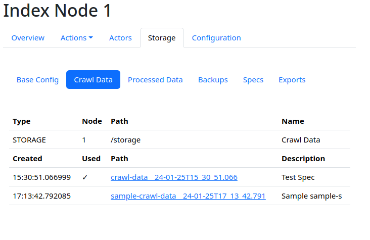
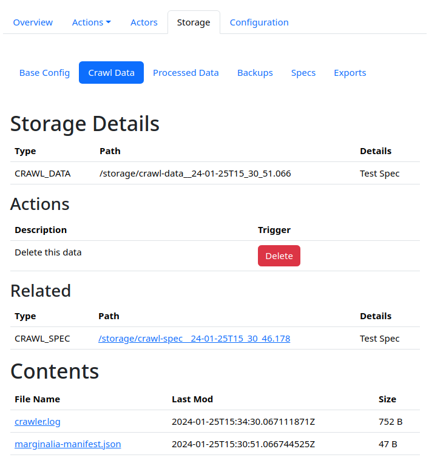

The system stores crawl data in `index-n/storage/`, along with processed data and other various long-term data.

The data generated by the system is in general viewable within the control GUI, under `Index Nodes -> Node N -> Storage`.

<figure>

<figcaption>Listing of data</figcaption>
</figure>

Clicking on the paths in this view will bring up details.

<figure>

<figcaption>Data details screenshot</figcaption>
</figure>

This view will show the path of the data relative to the node storage root (e.g. `install-dir/index-1` on disk),
its relation to other data (e.g. crawl data to processed data), and any files in the root directory of the crawl data.

These can be directly downloaded from this view.  Note that directories are not shown in this view.  This is due to size constraints.

A special file `marginalia_manifest.json` exists in all storage objects. This enables the system to recover information about
the directory in the event of an irrecoverable database error.  It also means if you move crawl data from e.g. `index-1` to `index-2`, then
the system will pick up the change automatically.

## Details

In general, the names of the storage directories reflect their content.  Crawl data is stored in directories with names like `crawl_data_...`,
and so on. In the root of the directory is a file called `crawler.log`, which is a journal of what has been crawled, and where it is stored.  It will relate domain names to subdirectories.

To get around file system limitations, the crawl data is stored in a subdirectory tree.  Each domain is stored in a parquet file.

Parquet files can be interrogated with SQL using e.g. [duckdb](https://duckdb.org/).
