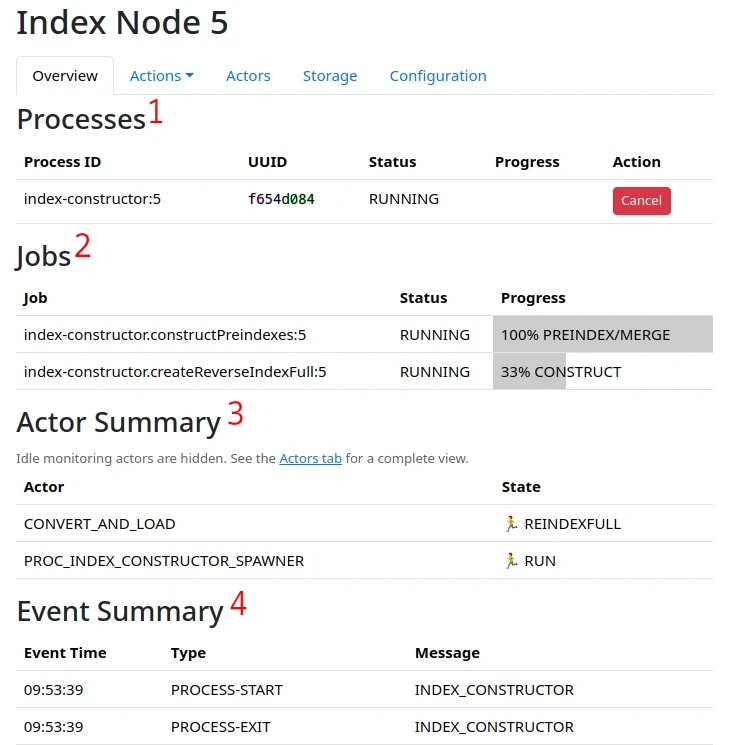

While processing data, the system will spawn child processes.  These are started by the executor process, and run on an index node.   

A summary of any processes running can be viewed in the Index Node overview tab, accessible in `Index Node -> Node N`.

<figure>

<figcaption>Index Node Overview with sections highlighted</figcaption>
</figure>

## Processes (1)

Processes correspond to a separate operating system process that is spawned to perform some work.  Some processes also shows its overall progress in the process table.

Processes can be terminated from this view.  This will abort the process, and reset any associated actors.  In some cases, when crawling, converting or loading; it is possible to use the a view accessible in `System -> Aborted Processes` to resume a process from where it was, e.g. a crawl will not re-fetch already fetched documents.  Non-resumable processes need to be restarted from scratch. 

Processes only linger in the 'aborted' state for a few days, before being cleaned up.

## Jobs (2)

Jobs are purely logical divisions of work shown to provide information about what the system is doing.  They are not interactive.

## Actor Summary (3)

The actor summary shows all actors in a non-resting state.  The state is presented.  If actors are in the 'ERROR' or 'END' state, action is needed to restart them.  

See the section on Actors for additional details. 

## Event Summary (4)

The event summary table will show you a glimpse of the system events associated with the current node.  It's a good way of learning about what the system has done.