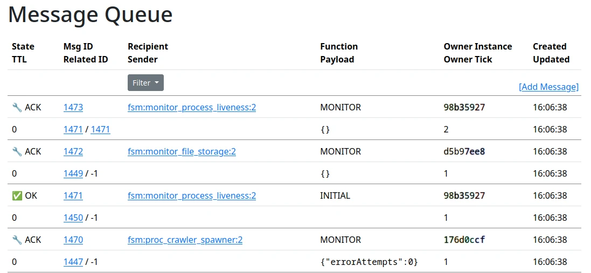

The system uses a message queue to coordinate the flow of data between processes.  A message is a bit like an email, it has a sender, a recipient, a subject, and a body.  The sender and recipient are the names of processes, and the subject and body are arbitrary strings.  The message queue is implemented using the mariadb database, and the messages are stored in a table called `MESSAGE_QUEUE`.  

The purpose of the message queue is to let processes communicate with each other in a way that is robust to system crashes, or process terminations.  Since it's expected for the processes involved to run for several hours, sometimes days or even weeks, it's a very real
possibility that the sender of a message will crash or be restarted before a response is received.

The message queue is a very low level abstraction, and not something that's intended for an operator to interact with directly in normal circumstances, however it is sometimes useful to be able to inspect the queue to see what's going on.  The message queue is exposed through the web interface under `System -> Message Queue`.  

This will bring up a page that looks like this:

<figure>
    
    <figcaption>Message Queue</figcaption>
</figure>

Clicking on a message ID will bring up a detailed view of the message, where its fields are layed out, and related messages are grouped together.  

This looks like this:

<figure>
    
    <figcaption>Message Queue Detail</figcaption>
</figure>

From here it's possible to copy the message, alter its state, or manually input a response. This is useful for debugging or error recovery, but should be used with caution.  The message queue is a low level abstraction, and it's possible to break the system by manually altering the state of a message. 

## Actors

On top of the message queue are Actors.  These are small programs that have an inbox, and can send and receive messages.   They are implemented as a state machine.  The state of the machine is stored in the message queue, and the state is updated by sending messages to the actor.  The actor will then process the message, and send a response.  The response is also a message, and the state of the actor is updated by the response.  The actor can also send messages to other actors, and the state of the other actors is updated by the messages.  This is how the system coordinates the flow of data between processes.

Actors perform both complex series of tasks, such as automatically loading processed crawl data; and maintenance duties, such as removing old data marked for deletion.  The actor system is designed to be resilient to failure, and will in many cases automatically resume where it left off if it is terminated or crashes.  Where this isn't possible, the Actor will enter a state 'ERROR' and will need to be manually restarted.  

This can be done in the Actors tab of the web interface, which looks like this:

<figure>
    
    <figcaption>Actors View; here two actors have been disabled for demonstration purposes</figcaption>
</figure>

In ordere to draw attention to problems, actors in an abnormal state (e.g. either running or in error) will also show up in the Actor Summary portion of the Index Node overview:

<figure>
    
    <figcaption>Actor Summary</figcaption>
</figure>

Some actors spin up in response to user action, but there are also a few daemon actors that continuously run to perform maintenance tasks, such as spawning processes or cleaning up files.  This function is indicated by the actor names.

A process-spawning actor has a name like `PROC_something_SPAWNER`, whereas a maintenance task has a name like `MONITOR_something`.